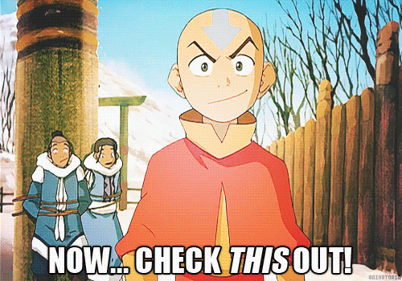

# *Hi there 👋🏼* 
 

  
  

  
<i>Just about me</i>

  <h4><samp> Hi there 👋🼠 welcome to my Github! I introduce myself as a Uncertified Arch_lnx User 👾, #FOSS Hacktivist  && Cyber Enthusiast. Feel free to ask anything under the sky._🛸â˜ï¸ ThankU</samp></h4>

  
<i>Statitics</i>

  

  

  

<samp>ThankU, 
Check Out My RepoS ⬇️  
  </samp>

